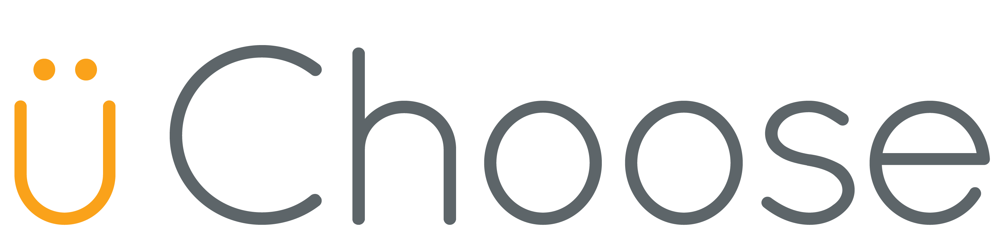

# 

## Capstone Project by Josh Nichols and Oliver Alonzo - December 2018

To run locally:
	* Download zip file
	* Start a php server on project directory
	* Navigate to index.html on the server

Special thanks to:
	* Mark Panning
	* [Semantic UI](https://semantic-ui.com)
	* [Cody House](https://codyhouse.co/gem/schedule-template/)
	* [Ken Wheeler](http://kenwheeler.github.io/slick/)
